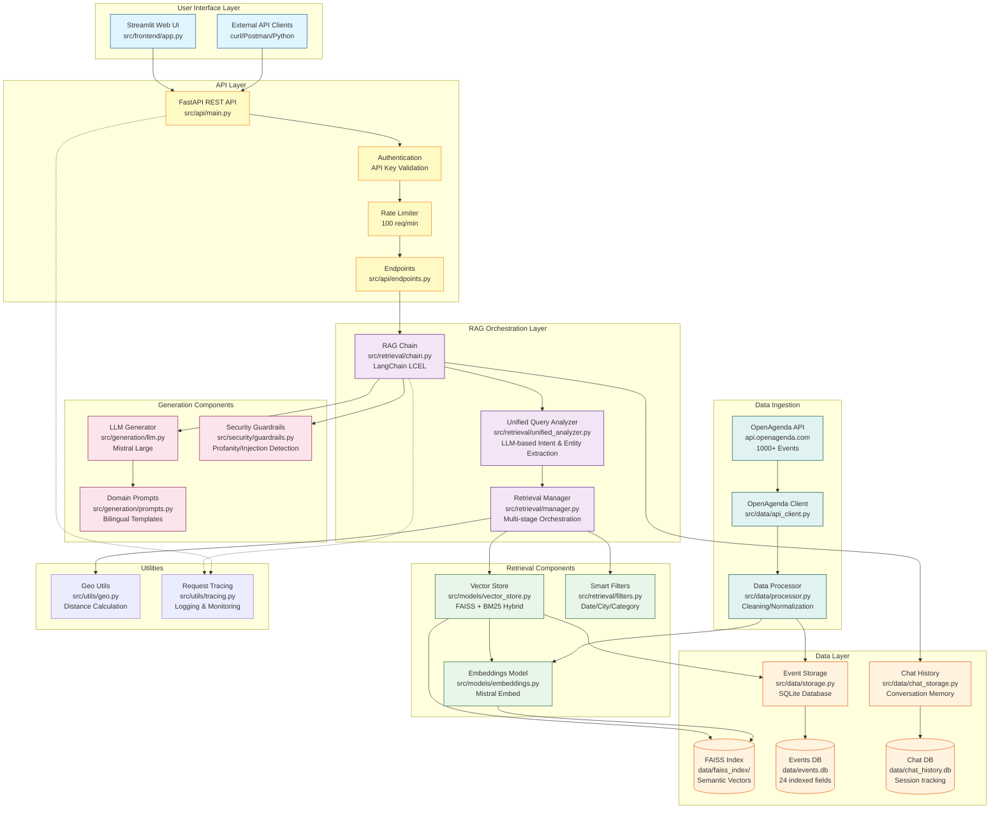
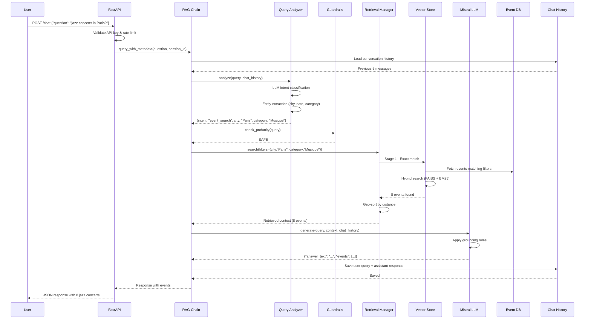
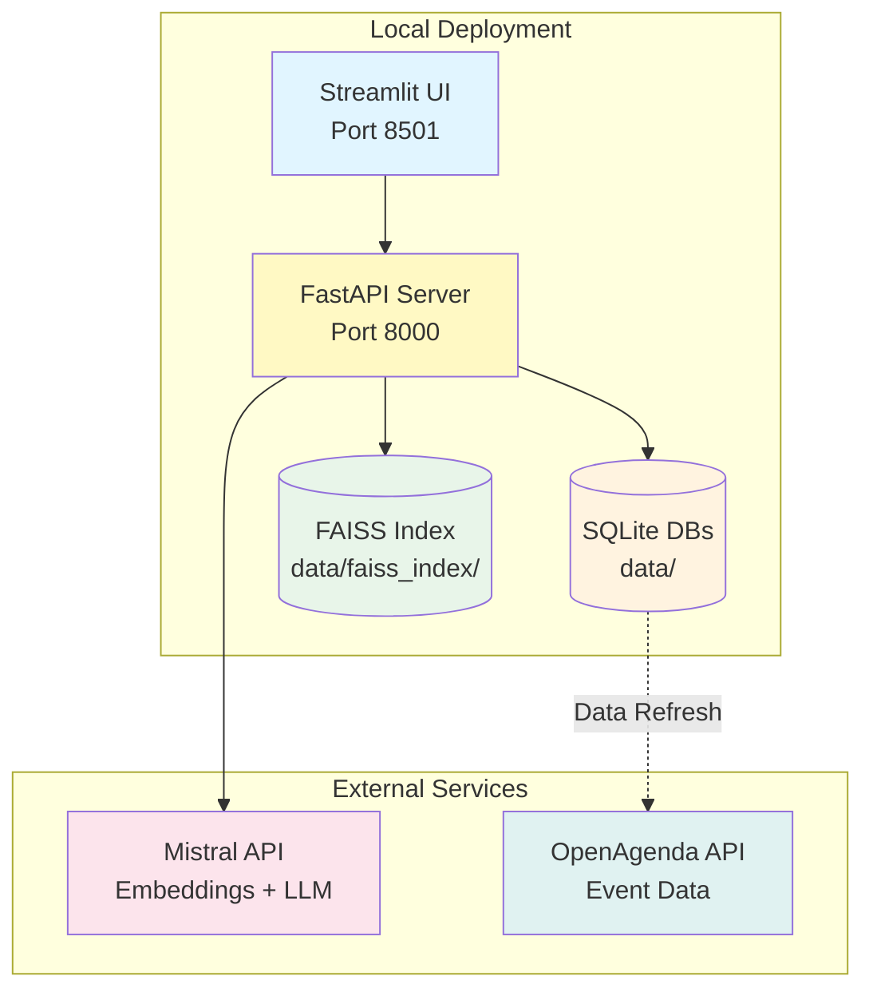

# System Architecture - Cultural Events RAG Assistant

## UML Component Diagram

## Component Responsibilities

### 1. User Interface Layer
**Components**: Streamlit UI, External API Clients

**Responsibilities**:
- Provide web-based chat interface for end users
- Allow external systems to query via REST API
- Display results with interactive maps and filters

---

### 2. API Layer
**Components**: FastAPI, Authentication, Rate Limiting, Routes

**Responsibilities**:
- Expose REST endpoints (`/chat`, `/health`, `/rebuild`)
- Validate API keys and enforce rate limits (100 req/min)
- Handle HTTP requests/responses with proper error handling
- Auto-generate OpenAPI/Swagger documentation

**Key Files**:
- `src/api/main.py` - FastAPI application setup
- `src/api/endpoints.py` - Route handlers
- `src/api/schemas.py` - Request/response models

---

### 3. RAG Orchestration Layer
**Components**: RAG Chain, Unified Analyzer, Retrieval Manager

**Responsibilities**:
- **RAG Chain**: Orchestrate entire query pipeline using LangChain LCEL
- **Unified Analyzer**: LLM-based intent classification and entity extraction
  - Detects: greeting, chitchat, capability, directions, abuse, off_topic, event_search
  - Extracts: city, event_type, dates, filters, language (fr/en)
  - **Filter Derivation Logic**: Converts user-friendly terms to database filters
    - `event_type` (user input: "jazz", "concert") → `category` (database: "Musique")
    - See: [src/retrieval/unified_analyzer.py:888-893](../src/retrieval/unified_analyzer.py) for implementation
    - Terminology: `event_type` = informal user term, `category` = formal database classification
- **Retrieval Manager**: Multi-stage retrieval with fallback strategies
  - Stage 1: Exact match (city + date + category)
  - Stage 2: Nearby cities fallback
  - Stage 3: Alternative date windows
  - Geo-sorting by distance from user location

**Key Files**:
- `src/retrieval/chain.py` - Main RAG pipeline
- `src/retrieval/unified_analyzer.py` - Query analysis
- `src/retrieval/manager.py` - Retrieval orchestration

---

### 4. Retrieval Components
**Components**: Vector Store, Embeddings Model, Smart Filters

**Responsibilities**:
- **Vector Store**: Hybrid search combining FAISS (semantic) + BM25 (keyword)
  - Reciprocal Rank Fusion (RRF) to merge results
  - Top-50 retrieval, reranked to top-10
- **Embeddings Model**: Mistral Embed (1024-dim vectors)
- **Smart Filters**: Post-retrieval filtering on:
  - Date (month, day, year, date ranges)
  - City (normalized with typo correction)
  - Category (mapped to 9 canonical types)
  - Price (is_free)
  - Audience (kids, family, professional)

**Key Files**:
- `src/models/vector_store.py` - FAISS + BM25 hybrid
- `src/models/embeddings.py` - Mistral embeddings
- `src/retrieval/filters.py` - Filter application

---

### 5. Generation Components
**Components**: LLM Generator, Domain Prompts, Security Guardrails

**Responsibilities**:
- **LLM Generator**: Mistral Large for natural language responses
  - Bilingual support (French/English auto-detection)
  - JSON output parsing with fallback
  - Circuit breaker for API failures (3 consecutive = open)
- **Domain Prompts**: Structured prompts with grounding rules
  - Faithfulness constraints (no hallucinations)
  - Source citation requirements
  - Bilingual templates
- **Security Guardrails**: Input validation
  - Profanity detection (Unicode-aware)
  - Prompt injection prevention
  - PII sanitization (emails, phone numbers)

**Key Files**:
- `src/generation/llm.py` - Mistral LLM client
- `src/generation/prompts.py` - Prompt templates
- `src/security/guardrails.py` - Security checks

---

### 6. Data Layer
**Components**: Event Storage, Chat History, FAISS Index, SQLite Databases

**Responsibilities**:
- **Event Storage**: SQLite database with 24 indexed fields
  - 1000+ cultural events from Île-de-France
  - Full-text search on title, description, scraped_content
  - Metadata: category, city, dates, coordinates, organizer
- **Chat History**: Session-based conversation memory
  - Multi-turn dialogue tracking
  - Filter carry-over across turns
  - Feedback collection (thumbs up/down)
- **FAISS Index**: Semantic vector search
  - IndexFlatIP (inner product similarity)
  - 1024-dimensional vectors
  - Real-time indexing on data updates

**Key Files**:
- `src/data/storage.py` - Event database operations
- `src/data/chat_storage.py` - Conversation memory
- `data/faiss_index/` - Vector index files
- `data/events.db` - SQLite event database
- `data/chat_history.db` - Conversation database

---

### 7. Data Ingestion
**Components**: OpenAgenda API Client, Data Processor

**Responsibilities**:
- **API Client**: Fetch events from OpenAgenda public API
  - Pagination support (100 records/request)
  - Error handling and retries
- **Data Processor**: Clean and normalize raw data
  - Unicode normalization (NFC)
  - Boilerplate removal (31 junk phrases)
  - Title cleaning (ALL CAPS → Title Case)
  - Location standardization
  - Deduplication (by title + city + date)
  - Semantic category classification (forced, never "Other")

**Key Files**:
- `src/data/api_client.py` - OpenAgenda client
- `src/data/processor.py` - Data cleaning pipeline
- `src/data/models.py` - Event data models

---

### 8. Utilities
**Components**: Geo Utils, Request Tracing

**Responsibilities**:
- **Geo Utils**: Distance calculation using Haversine formula
  - City coordinates lookup (176 Île-de-France cities)
  - Nearby city search (< 15km radius)
- **Request Tracing**: Logging and monitoring
  - Trace ID generation per request
  - Performance timing (retrieval, generation)
  - Error logging with context

**Key Files**:
- `src/utils/geo.py` - Geographic utilities
- `src/utils/tracing.py` - Tracing infrastructure

---

## Data Flow Sequence

### Query Processing Pipeline

---

## Technology Stack

| Layer | Technology | Purpose |
|-------|-----------|---------|
| **Frontend** | Streamlit | Web UI with interactive components |
| **API** | FastAPI | REST API with auto-generated docs |
| **Vector Store** | FAISS | Semantic similarity search |
| **Keyword Search** | BM25 (rank-bm25) | Lexical matching |
| **Embeddings** | Mistral Embed | 1024-dim semantic vectors |
| **LLM** | Mistral Large | Natural language generation |
| **Orchestration** | LangChain | RAG pipeline composition |
| **Database** | SQLite | Event & conversation storage |
| **Data Source** | OpenAgenda API | Cultural events (1000+ records) |
| **Language** | Python 3.11+ | Core implementation |
| **Dependency Mgmt** | Poetry | Package management |

---

## Performance Characteristics

| Metric | Value | Notes |
|--------|-------|-------|
| **Query Latency (P50)** | 2-3 seconds | Including LLM generation |
| **Query Latency (P95)** | 4-6 seconds | Complex multi-stage retrieval |
| **Retrieval Accuracy** | 85%+ | Precision on golden dataset |
| **Faithfulness** | 90%+ | LLM grounding to sources |
| **Bilingual Coverage** | 70%+ | FR/EN query equivalence |
| **Vector Dimensions** | 1024 | Mistral Embed output |
| **Index Size** | ~1000 events | Île-de-France cultural events |
| **Rate Limit** | 100 req/min | Per IP address |

---

## Security & Reliability

### Security Measures
- **API Key Authentication**: Required for all endpoints
- **Rate Limiting**: 100 requests/minute per IP
- **Input Validation**:
  - Profanity detection (Unicode-aware)
  - Prompt injection prevention (20+ patterns)
  - PII sanitization (emails, phone numbers)
- **Output Grounding**: LLM constrained to source documents

### Reliability Features
- **Circuit Breaker**: LLM failures trigger circuit open (3 consecutive)
- **Fallback Strategies**: Multi-stage retrieval with nearby cities
- **Error Handling**: Graceful degradation with user-friendly messages
- **Request Tracing**: Full logging with trace IDs
- **Graceful Shutdown**: Signal handlers for clean API shutdown

---

## Deployment Architecture

**Deployment Options**:
1. **Local Development**: Poetry + Python 3.11+
2. **Docker**: Containerized with docker-compose
3. **Cloud**: Deployable to AWS/GCP/Azure with minimal config

---

## Extensibility & Future Enhancements

### Current Limitations
1. **Event Reference Resolution**: Cannot answer "What's the price of the last event?" (requires coreference)
2. **Multi-Event Comparison**: Cannot compare multiple events (e.g., "Which is cheaper?")
3. **Booking Integration**: Read-only, no ticket purchase capability
4. **User Preferences**: No persistent user profiles

### Planned Improvements
1. **Event Tracking**: Store which events were shown per session
2. **Metadata Queries**: Answer specific questions about event fields
3. **Multi-Event Reasoning**: Compare and rank events by criteria
4. **Personalization**: User preference learning
5. **Booking API**: Integration with ticketing platforms
6. **Real-time Updates**: WebSocket support for live event changes

---

## References
- [LangChain Documentation](https://python.langchain.com/)
- [FAISS Documentation](https://github.com/facebookresearch/faiss)
- [Mistral AI API](https://docs.mistral.ai/)
- [OpenAgenda API](https://developers.openagenda.com/)
- [FastAPI Documentation](https://fastapi.tiangolo.com/)
